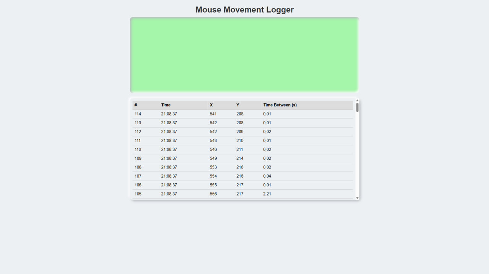

Below is a sample **README.md** file that details how to set up and use both the **HTML-based Mouse Movement Logger** and the **DigiSpark Mouse Mover**. You can adapt it to your needs. The sections include an overview, setup instructions, usage, and even a placeholder for a screenshot of the running HTML file.

---

# Mouse Movement Logger & DigiSpark Mouse Mover

## Overview

This repository contains two main components:

1. **Mouse Movement Logger (HTML/JS)**:  
   An HTML page (`mouse-movement-logger.html`) that logs mouse movements within a designated area of a web page. The logger visually changes the color of the box when the mouse moves and logs (in a table) each movement with coordinates, timestamps, and the time interval between successive moves.

2. **DigiSpark Mouse Mover (Arduino .ino)**:  
   A small piece of code (`digispark-mouse-mover.ino`) meant for a Digispark (or other ATtiny85-based board with USB) that moves the mouse cursor in a small square pattern at random intervals. This helps keep your computer awake or simulate mouse movement when you are away.

Below is a short description of how these two projects work and how to set them up on your machine.

---

## Table of Contents

1. [Mouse Movement Logger - HTML/JS](#mouse-movement-logger---htmljs)
   - [Features](#features)
   - [Requirements](#requirements)
   - [Setup and Usage](#setup-and-usage)
   - [Example Screenshot](#example-screenshot)

2. [DigiSpark Mouse Mover - Arduino .ino](#digispark-mouse-mover---arduino-ino)
   - [Features](#features-1)
   - [Requirements](#requirements-1)
   - [Setup and Usage](#setup-and-usage-1)
   - [Notes](#notes)

3. [License](#license)

---

## Mouse Movement Logger - HTML/JS

### Features

- **Neomorphic UI**: Subtle shadow effects for a modern 3D “soft” look.
- **Visual Feedback**: The main box (`#mouseZone`) changes color from green to red while the mouse is moving.
- **Logging**: Logs each mouse movement in a table showing:
  - Movement count (incrementing number)
  - Time (localized)
  - X and Y coordinates (relative to the box)
  - Time difference since the last move (in seconds, with comma as decimal separator)

### Requirements

- A modern web browser (Chrome, Firefox, Safari, Edge, etc.).
- No server is required; you can open the HTML file locally.

### Setup and Usage

1. **Clone or Download** this repository onto your local machine.
2. Locate the `mouse-movement-logger.html` file.
3. Open it in your preferred web browser (e.g., double-click or right-click → “Open with…”).
4. Move your mouse inside the green box at the top of the page:
   - Observe the box turn red while you move the mouse.
   - A new entry will appear at the **top** of the logging table each time you move.

You can scroll within the table container if the logs become extensive.

### Example Screenshot
```md

```

---

## DigiSpark Mouse Mover - Arduino .ino

### Features

- Moves the mouse in a small square pattern.
- Waits a random time (± 10 seconds around a base of 60 seconds) before repeating the movement, simulating user activity.
- Blinks an LED (on DigiSpark pin 1) during each incremental mouse move for visual feedback.

### Requirements

1. A **Digispark** board (or a similar ATtiny85-based USB board).
2. [Arduino IDE or similar environment for Digispark](https://digistump.com/wiki/digispark/tutorials/connecting) installed.
3. **DigiMouse** library (already included in most Digispark Arduino core installations).

### Setup and Usage

1. **Install Digispark/ATTiny85 Arduino Environment**:  
   - In Arduino IDE, go to **File → Preferences**.
   - Add `http://digistump.com/package_digistump_index.json` in **Additional Board Manager URLs** (if not already present).
   - Go to **Tools → Board → Boards Manager**, search for **Digistump AVR Boards**, and install it.
2. **Open `digispark-mouse-mover.ino`** in Arduino IDE.
3. **Select Board**:  
   - **Tools → Board → Digispark (Default - 16.5mhz)** (or the correct variant for your device).
4. **Connect Your Digispark Board** when prompted:  
   - Note that Digispark boards often require you to plug them in after the IDE has compiled the sketch and is ready to upload.
   - Follow the on-screen instructions provided by the Arduino IDE if you’re new to Digispark.
5. **Upload** the sketch to your Digispark.
6. **Test**:  
   - Once powered (by USB), the device will move the mouse cursor in a small square pattern after ~60 seconds, plus or minus up to 10 seconds.  
   - An LED on pin 1 will blink briefly during each small mouse move.

### Notes

- **Warning**: When the DigiSpark code is running, it will frequently take control of your system’s mouse cursor. Make sure your environment is prepared for unexpected cursor movements (save your work, be ready to unplug the device, etc.).
- The movement is minimal and random in delay, but still noticeable. If you want it less intrusive, you can reduce the pixel steps or alter the timing in the code.

---

## License

Choose an open-source license that fits your project (e.g., MIT, Apache, GPL). If you haven’t done so, you might include a simple statement:

```
This project is licensed under the MIT License - see the LICENSE.md file for details.
```

---

**Enjoy the Mouse Movement Logger and the DigiSpark Mouse Mover!** If you have any questions or issues, feel free to open an issue in the repository or consult online resources.